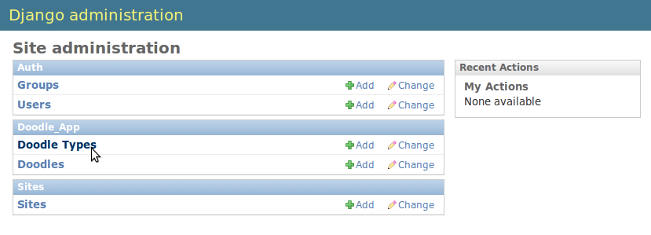

Models In Depth
===============

In our quickstart run through in the previous section we created a simple model
and saw how you can manipulate the model using the django python console. We
also saw that you can create a user interface for the model quickly by using
the admin application that comes as a standard part of django.

The heart of Django is the :abbr:`ORM (Object Relational Mapping)` functionality it
provides. With Django, you program and think in python and the application
framework does all the nuts and bolts stuff behind the scenes or serialising
your saved models into the database and deserialising the models again when you
need to access them.

We saw a simple example of this, for example by doing::
   
   myDoodle.save()

A record was created in the database representing the model. And when we did::
   
   myDoodle2 = Doodle.objects.get(id=1)

The django framework took care of deserialising the model from the database and
making it available to us as a python object. Models are by convention defined
in :file:`<yourapp>/models.py`. Defining a model is simply a matter of adding
a new class to the above file.

The model creation consists of four steps:

+ Create a **new class** that inherits from //models.Model// in
  :file:`<yourapp>/models.py`. This class will be mapped to a table entity
  on the database backend.
+ Add the **property definitions** to your class. These will be mapped to
  fields in the table on the database backend.
+ Define the **metadata inner class**. This provides you a way to specify how 
  the models should be shown to the users and created in the database. For 
  example, you can use the metadata inner class to specify a non-default 
  backend table name.
+ Use the manage.py **syncdb** command to create the backend database model 
  and perform an integrity check of the model.

Lets look again at the model definition we created earlier, but with some extra
comments::
   
   # Our base class
   from django.db import models
   # import GeoDjango stuff to support spatial data types
   from django.contrib.gis.db import models
   # Use python time goodies
   import datetime 
   
   class Doodle(models.Model):
       """A class defines our model if it inherits from models.model"""
       name = models.CharField(max_length=255)
       """The name of our doodle"""
       doodle_date = models.DateTimeField('DateAdded', 
                  auto_now=True, auto_now_add=False)
       """An auto populated date field"""

       class Meta:
           """Meta (inner) class for our Doodle model"""
            verbose_name = ('Doodle')
            """Name to be used in the user interface (generated web pages) for
            this model (defaults to model name)."""
            verbose_name_plural = ('Fantastic Doodles')
            """Plural name to be used in the user interface (a default
            pluralisation will be given if none specified)."""
            ordering = ('doodle_date','name',)
            """Column ordering to be used by default if a collection of model
            instances is obtained."""

Field Types
-----------

The different types of field that you can use in django models are described in
the `Django
documentation<http://docs.djangoproject.com/en/dev/ref/models/fields/>`_.
There are a number of different field types you can use, including special
types that will build foriegn key constraints, multikey join tables, lookup
lists and so on. Here is a complete list of allowed types:

Standard field types:

* AutoField
* BooleanField
* CharField
* CommaSeparatedIntegerField
* DateField
* DateTimeField
* DecimalField
* EmailField
* FileField
* FilePathField
* FloatField
* ImageField
* IntegerField
* IPAddressField
* NullBooleanField
* PositiveIntegerField
* PositiveSmallIntegerField
* SlugField
* SmallIntegerField
* TextField
* TimeField
* URLField
* XMLField

Relationship fields:

* ForeignKey
* ManyToManyField
* OneToOneField

Spatial field types:

* PointField
* LineStringField
* PolygonField
* MultiPointField
* MultiLineStringField
* MultiPolygonField
* GeometryCollectionField

Verbose Names
-------------

You can use :keyword:`verbose_name` to give the model field a more friendly name
 hat will be shown on forms etc. 

.. note:: For foreign key and other relationship fields, you must place the
  verbose name **after** the relation name. e.g::
   
   status = models.ForeignKey(Status,verbose_name="Order Status")

Choices
-------

If you want to restrict the values that a user can choose from in order to
populate the field. You can do this using a list e.g.::
   
   myChoices = (("a" , "Pothole"), ("b" , "Road Sign"), ("c" , "Vagrants"))

Then when you create your field you would do::
   
   name = models.CharField(max_length=255,choices=myChoices)

If you open the doodle model in the admin web interface, you should see that
the text field for name is now replaced with a combo with the items listed in
myChoices in it.

Personally I think using the choices option is usually better implemented using
a separate model and then using a relationship field. If you are really sure
the choices list will never change, you could use it. Let me show you how we
would rather implement the choice using a second model and a relationship
field.

Relationship fields
-------------------

Relationship fields are used to express foreign key joins - you can have
one-to-many, many-to-many etc. type relationships. The underlying 'plumbing' of
these relationships is built for you in the backend database by Django.

First delete the myChoices... line we created above. Next add a new class to
models.py (put it before the doodle class) that looks like this::
   
   class DoodleType(models.Model):
       """A look up table for doodle types"""
       name = models.CharField(max_length=255)
       """The name of this type."""
       objects = models.Manager()
       """Optional name for the model manager instance for this model."""
   
       def __unicode__(self):
           """Return a plain text string if this object is cast to str"""
           return self.name
   
       class Meta:
           db_table = 'doodletype'
           """You can override the default db table name for the model, but 
           I don't recommend it."""
           verbose_name = ('Doodle Type')
           """User friendly name for our model."""
           verbose_name_plural = ('Doodle Types')
           """User friendly pluralisation."""
           ordering = ('name',)
           """Default field to order by."""

.. note:: This is a good use case for using :file:`initial_data.json` fixtures -
   when you want to be sure that the application or test environment is always
   initialised with your lookup lists populated.

Next, change the :keyword:`Doodle.name` field from a charfield to one that
looks like this::
   
   name = models.CharField(max_length=255)

And add Doodle.type like this::
   
   type = models.ForeignKey(DoodleType)

.. note:: If you want to, you can specify a default value across the ForeignKey
   relate by doing e.g.::
      
      doodle_type = models.ForeignKey(DoodleType, 
                                      default=DoodleType.objects.get(id=1))
   
   (which uses the first instance of doodle type as the default value).

To register the changes in our models, you need to run syncdb again. However we
have changed an existing model's field type (:keyword:`Doodle.name`) which
means that model's table definition also needs to be synced to the database.
Before we can do that we need to drop its table. We will discuss later how to
deal with data that may be in a table if you need to replace it with one that
contains existing functionality. For sqlite, just use the sqliteman application
to select the table then delete it. 

.. image:: img/image007.png

If you are using postgresql as a backend you can do::
   
   echo "drop table doodle;" > psql django_project
   python manage.py syncdb

or::
   
   python manage.py sqlreset doodle_app | psql django_project

To manage the new model, we need to add a new entry to
:file:`doodle_app/admin.py`::
   
   from models import DoodleType
   
   class DoodleTypeAdmin(admin.ModelAdmin):
       list_display = ('name',) 
   
   admin.site.register(DoodleType, DoodleTypeAdmin)

If you go back to your doodle admin interface now it should look something like
this:

.. image:: img/image009.png

You will notice there is now a little + icon next to the Name field. If you
click on it, the admin interface will pop up a form where you can manage the
list of names in the DoodleType model.

Unit Testing
------------

Whenever we add a new feature like this (changing models, adding new models),
we should run our tests and update them if needed or address the causes of
failures. Let's see what happens when we run our tests with the above changes::
   
   $ python manage.py test doodle_app
   Creating test database for alias 'default'...
   Problem installing fixture '/home/web/django-training/django_project/doodle_app/fixtures/test_data.json': 
   Traceback (most recent call last):
   ..
   ..
   ..
   return Database.Cursor.execute(self, query, params)
   IntegrityError: doodle_app_doodle.doodle_type_id may not be NULL
   ----------------------------------------------------------------------
   1 test in 0.008s
   FAILED (errors=1)
   Destroying test database for alias 'default'...

You can see our test has immediately informed us that our changes have broken
our application! This is useful because we get to fix it instead of perhaps
finding out after the changes have been deployed into production.

The critical error meessage above is this::
   
   IntegrityError: doodle_app_doodle.doodle_type_id may not be NULL

This is actually good news - it is Django refusing to load the Doodles from the
fixture because they don't have valid related DoodleTypes. To address this we will do the following:

* Create some doodle type entries in the admin interface
* Generate fixtures for :file:`initial_data.json` that will populate the
  DoodleType model with a few entries.
* Update our test fixtures for Doodle
* Rerun the tests and check that they pass.

Here is how I created the initial_data.json fixture after adding some
DoodleType's in the admin interface::
   
  python manage.py dumpdata --indent=4 doodle_app.DoodleType > doodle_app/fixtures/initial_data.json 

Then I updated my test fixture (:file:`doodle_app/fixtures/test_data.json`),
assigning a foreign key reference for all of the Doodle records and updating
the doodle names e.g.::
   
  [
      {
          "pk": 1, 
          "model": "doodle_app.doodle", 
          "fields": {
              "doodle_type": 1, 
              "name": "Doodel 1", 
              "doodle_date": "2012-04-21T12:38:31.789Z"
          }
      }, 
      {
          "pk": 2, 
          "model": "doodle_app.doodle", 
          "fields": {
              "doodle_type": 2, 
              "name": "Doodle 2", 
              "doodle_date": "2012-04-21T12:38:38.894Z"
          }
      }, 
      {
          "pk": 3, 
          "model": "doodle_app.doodle", 
          "fields": {
              "doodle_type": 2, 
              "name": "Doodle 3", 
              "doodle_date": "2012-04-21T12:38:49.862Z"
          }
      }
  ]

We also need to update our test for Doodle so that doodle_type gets initialised::

    def testCreation(self):
        """Test Doodle creation"""
        myCount = Doodle.objects.all().count()
        myDoodle = Doodle()
        myDoodle.name = 'Test Doodle'
        myDoodleType = DoodleType.objects.get(id=1)  # added
        myDoodle.doodle_type = myDoodleType          # added
        myDoodle.save()
        for myDoodle in Doodle.objects.all():
            print myDoodle.name
        myMessage = 'Expected one more doodle after creation'
        assert Doodle.objects.all().count() > myCount, myMessage

The updated test tries to create a DoodleType instance and assign it to the
Doodle instance before the Doodle is saved.

.. note:: There are various strategies to deal with changes to the underlying
   models in django. Here are the three that I make use of:

   + Drop the data in the modified table, drop the table and rerun syncdb. This
     is useful when you don't care about the existing data.
   + Use sql to manually change the underlying database to keep it in sync with
     your models.
   + Use a tool like `South <http://south.aeracode.org/>`_ to automate
     migrations.

   Wherever possible, I make use of South, but in the interests of simplicity I
   am not covering it here.

Let's verify that our updated test runs now.::
   
   python manage.py test doodle_app
   Creating test database for alias 'default'...
   Doodel 1
   Doodle 2
   Doodle 3
   Test Doodle
   .
   ----------------------------------------------------------------------
   Ran 1 test in 0.009s
   
   OK
   Destroying test database for alias 'default'...

I would like to empahasise the difference between :file:`initial_data.json` and
:file:`test_data.json`:

* :file:`initial_data.json` is a **production** fixtire. It is restored into
  the database every time you run syncdb (and consequently it is also restored
  when you run any test). It is useful for prepopulating the database with
  lookup lists and perhaps user accounts. 
* :file:`test_data.json` is a **test** fixture (you can name this whatever you
  like and have multiple test fixtures to provide for different scenarios). You
  reference one or more test fixtures in your unit test, effectively telling
  your test class what test data should be used while running the tests.

One last thing
--------------

If you were alert, you might have wondered what is to prevent the same
DoodleType name being added twice. In fact django automatically takes care of
this for you. If you are using a backend like postgresql, django will also add
a unique constraint to that field::
   
   django_project=# \d doodle_type
   Table "public.doodle_type"
   Column |          Type          |                        Modifiers                        
   --------+------------------------+---------------------------------------------------------
    id     | integer                | not null default nextval('doodletype_id_seq'::regclass)
    name   | character varying(255) | not null
   Indexes:
   "doodle_type_pkey" PRIMARY KEY, btree (id)
   "doodle_type_name_key" UNIQUE, btree (name)

So you will see in the next snippet what would happen if you try to insert a
duplicate record::
   
   django_project=# select * from doodle_type;
    id | name 
   ----+------
     1 | Test
   (1 row)
   
   django_project=# insert into doodletype (name) values ('Test');
   ERROR:  duplicate key value violates unique constraint "doodletype_name_key"

Once again django just takes care of stuff for you in the background and you
don't need to worry about too many small details...

