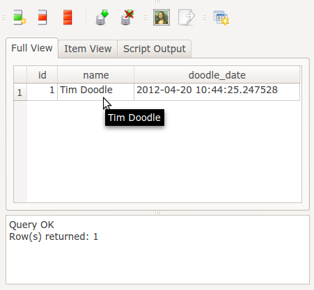

Create a model
==============

Now the fun starts. Django has a easy, intuitive and powerful way to define
models. Each model is a python class. Edit :file:`doodle_app/models.py` and add::

   from django.db import models
   import datetime

   class Doodle(models.Model):
       name = models.CharField(max_length=255)
       doodle_date = models.DateTimeField('DateAdded', 
                auto_now=True, auto_now_add=False)

       class Meta:
           verbose_name = ('Doodle')
           verbose_name_plural = ('Doodles')
           ordering = ('doodle_date',)

Nifty - now lets deploy our new model!

:command:`python manage.py syncdb`

You will see output something like this::

   Creating tables ...
   Creating table doodle_app_doodle
   Installing custom SQL ...
   Installing indexes ...
   Installed 0 object(s) from 0 fixture(s)

What just happened? Django just created the backend tables for the Object
Relational Mapping (ORM) between our model and the backend. Let's install a
SQLite Client and take a look.

:command:`sudo apt-get install sqliteman`

Then open the database:

:command:`sqliteman django.db`

Lets take a look at the table it created:

.. image:: img/image001.png

Set up shell_plus
-----------------

Django provides a python shell for interactive testing of models. This is the
same as a normal python shell but it sets up all the environment variables /
python path etc. needed to find your classes. Then django :file:`manage.py` command 
lets you open a python shell and interact with the models of your application.

Before we dig in though, let's add a django application in our :file:`settings.py` to
make our lives a little easier::
  
  INSTALLED_APPS = ( 
      'django.contrib.auth',
      'django.contrib.contenttypes',
      'django.contrib.sessions',
      'django.contrib.sites',
      'django.contrib.messages',
      'django.contrib.staticfiles',
      # Uncomment the next line to enable the admin:
      # 'django.contrib.admin',
      # Uncomment the next line to enable admin documentation:
      # 'django.contrib.admindocs',
      'django_extensions', <-- new application added
      'doodle_app',
    )

Django Extensions (we installed it with pip when we set up our virtual
environment) is a django helper that gives us all sorts of things to make our
lives easier - one of which is 'shell_plus' - which will open our python prompt
in an ipython shell (ipython was also installed by pip earlier). We can start
the shell by doing this:

:command:`python manage.py shell_plus`

.. tip::
  You can leave the shell any time by pressing :kbd:`Crtl-D`.

One of the main reasons I like using 'shell_plus' (rather than just 'shell') 
is that it imports all your django python modules for you::
   
   From 'auth' autoload: Permission, Group, User
   From 'contenttypes' autoload: ContentType
   From 'sessions' autoload: Session
   From 'sites' autoload: Site
   From 'doodle_app' autoload: Doodle

Create a model instance
-----------------------

Ok so let us create a model instance so you can really see what all the fuss is
about::
   
   myDoodle = Doodle()
   myDoodle.name = 'Tim Doodle'
   myDoodle.save()

This is really the 'hello world' of django. We created a doodle instance and
saved it. Take a look at what happened in the database

Lets see what the above code does in the backend:

The object we created in python was serialised into the database when we called
its **save** method. And all its properties we declared in the
:file:`models.py` file are available for that object.

So in a few minutes we have created a code base that uses :abbr:`ORM (object
relational mapping)` and can be used from any python context (not just Django
web apps).

Lets look at a few more examples of things you can do::
   
   print Doodle.objects.all().count()  # 1
   myDoodle2 = Doodle()
   myDoodle2.name = 'foobar'
   print Doodle.objects.all().count()  # 1
   myDoodle2.save()
   print Doodle.objects.all().count()  # 2

We can see from the above that a doodle is not serialised into the database 
unless you call its **save** method.

You can also construct objects using python named parameters like this::
   
   myDoodle3 = Doodle(name='digettydoo')
   myDoodle3.save()

We can also see that every django model gets a bunch of 'free' stuff - like
the model manager which will fetch you collections of objects from the object
store. Each saved object is assigned a unique id (the id field is added 
automatically to your model by django)::

  In [15]: myDoodle.id
  Out[15]: 1

  In [16]: myDoodle2.id
  Out[16]: 2

  In [17]: myDoodle3.id
  Out[17]: 3

You can also do `queries
<https://docs.djangoproject.com/en/dev/topics/db/queries/>`_ on the object
store, which get converted in the background into SQL for you by django and
executed against the database::
   
   In [25]: myDoodles = Doodle.objects.filter(id__lt = '3')

   In [26]: for myItem in myDoodles:
      ....:     print myItem.name
         ....: 
         Tim Doodle
         foobar

By this point you should understand the basic concept of a django model - 
it is just a class that is mapped to the database and inherits some nice
functionality from django.

You can treat this like any normal class for example by adding new methods.

Here is what our database looks like after doing the above examples:

.. image:: img/image003.png

