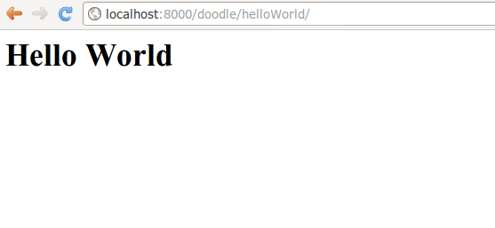

Views
=====

Ok by now you should understand the basic concept of a model - you define it
using a python :keyword:`class`, synchronise the database to your model
definitions, and then you can add the model to the admin user interface if you
want to get a quick & dirty UI for your models.

Invariably however, you will want to create your own views and forms. In other
words, you will want your site to have its own unique look and feel and user
interactions, rather than the canned environment of the admin interface.

To do that will start by delving into views a little.

Hello World
-----------

I bet you have been waiting for this moment :-) While a model represents an
object or entity, a view represents a particular view of an object or group
of objects. We can also have a view that does not reflect the state of any
particular object, but rather just some hard coded information - which is what
we will look at first - we are going to make a view that returns ``Hello World``
as a string.

Hello World Test
----------------

Since we are promoting test driven development here, let's write a test first
and then implement the view. We can write it in :file:`doodle_app/tests.py`::
   
   from django.test.client import RequestFactory
   from views import helloWorld
   
   class TestViews(TestCase):
       """    Tests that doodle_app views work."""
   
       def setUp(self):
           """very test needs access to the request factory.
              So we create it here"""
           self.factory = RequestFactory()
   
       def testHelloWorldView(self):
           """Test hello world view works."""
           myRequest = self.factory.get('/doodle/helloWorld')
           myResponse = helloWorld(myRequest)
           self.assertEqual(myResponse.status_code, 200)
           myExpectedString = '<h1>Hello World</h1>'
           myMessage = ('Unexpected response from helloWorld'
                        ' - got %s, expected %s' %
                        (myResponse.content, myExpectedString))
           self.assertEqual(myResponse.content, myExpectedString, myMessage)

When you try to run this test, you expect a failure (since we haven't actually
written our view yet), but we have defined the preconditions under which the
test should pass, so we know that as soon as it does pass, our work is done!

So run the test and you should get output which ends something like this::
   
   File "/home/web/django-training/django_project/doodle_app/tests.py", line 5, in <module>
   from views import helloWorld
   ImportError: cannot import name helloWorld

Good our test fails! Lets implement the view now...

Hello World Implementation
--------------------------

Open up your :file:`doodle/views.py` file. It should contain something like
this::
   
   # Create your views here.

Looks like someone was here before us then eh? The views stub was created when
we created our application. Views in django are simply function definitions so
we can create one like this::
   
   from django.http import HttpResponse
   
   
   def helloWorld(theRequest):
       """A simple hello world view"""
       return HttpResponse('<h1>Hello World</h1>')

Thats about the simplest view you can make. The HttpResponse class knows how to
return any string you give it as a web page back to the clients browser.

You will notice that the helloWorld view takes a single parameter 'theRequest'
which is an object containing all of the request context information from the
client. For example it has any form post variables, the user agent (which
browser is being used) etc. Since this is a really simple view the request
parameter is actually ignored, but we will see later how to make good use of
it. For now you should note that every view is passed a request in its
signature.

Test the view
-------------

Ok now we can run our tests again (:command:`python manage.py test doodle_app`)
which should produce output like this::
   
   Creating test database for alias 'default'...
   Doodel 1
   Doodle 2
   Doodle 3
   Test Doodle
   .Hello World OK
   .
   ----------------------------------------------------------------------
   Ran 2 tests in 0.010s
   
   OK
   Destroying test database for alias 'default'...

The controller
--------------

Remember we are implementing the :abbr:`Model View Controller (MVC)` design
pattern here. We have a model (:keyword:`Doodle`), we have a view
(:keyword:`helloWorld`). Now lets implement the controller 
(`django docs <https://docs.djangoproject.com/en/dev/topics/http/urls/>`_).
The idea is to make our view available at the url:

   http://localhost:8000/doodle/helloWorld/.

Controller Test
---------------

Of course we should first write a test, and then implement our controller, that
way we will know when we have written exactly enough code for our new feature.

Here is my updated :file:`doodle_app/tests/py` file in its entirety::
   
   from django.test import TestCase
   from models import Doodle
   from models import DoodleType
   from django.test.client import RequestFactory
   from views import helloWorld
   from django.test.client import Client
   
   class DoodleTest(TestCase):
       """Unit test for the Doodle model"""
       fixtures = ['test_data.json']
   
       def testCreation(self):
           """Test Doodle creation"""
           myCount = Doodle.objects.all().count()
           myDoodle = Doodle()
           myDoodle.name = 'Test Doodle'
           myDoodleType = DoodleType.objects.get(id=1)
           myDoodle.doodle_type = myDoodleType
           myDoodle.save()
           for myDoodle in Doodle.objects.all():
               print myDoodle.name
           myMessage = 'Expected one more doodle after creation'
           assert Doodle.objects.all().count() > myCount, myMessage
   
   
   class TestViews(TestCase):
       """    Tests that doodle_app views work."""
   
       def setUp(self):
           """very test needs access to the request factory.
              So we create it here"""
           self.factory = RequestFactory()
   
       def testHelloWorldView(self):
           """Test hello world view works."""
           myRequest = self.factory.get('/doodle/helloWorld')
           myResponse = helloWorld(myRequest)
           self.assertEqual(myResponse.status_code, 200)
           myExpectedString = '<h1>Hello World</h1>'
           myMessage = ('Unexpected response from helloWorld'
                        ' - got %s, expected %s' %
                        (myResponse.content, myExpectedString))
           self.assertEqual(myResponse.content, myExpectedString, myMessage)
   
       def testHelloWorldUrl(self):
           """Test that the helloWorld url works using the django test web client.
           """
           myClient = Client()
           myResponse = myClient.get('/doodle/helloWorld/')
           self.assertEqual(myResponse.status_code, 200)
           myExpectedString = '<h1>Hello World</h1>'
           myMessage = ('Unexpected response from helloWorld'
                        ' - got %s, expected %s' %
                        (myResponse.content, myExpectedString))
           self.assertEqual(myResponse.content, myExpectedString, myMessage)

You can see we are starting to repeat some code - a good indication that 
some refactoring is needed! Let's run our test now and see what happens.::
   
   ======================================================================
   ERROR: testHelloWorldUrl (doodle_app.tests.TestViews)
   Test that the helloWorld url works using the django test web client.
   ----------------------------------------------------------------------
   Traceback (most recent call last):
     File "/home/web/django-training/django_project/doodle_app/tests.py", line 50, in testHelloWorldUrl
       myResponse = myClient.get('/helloWorld/')
     File "/home/web/django-training/python/local/lib/python2.7/site-packages/django/test/client.py", line 439, in get
       response = super(Client, self).get(path, data=data, **extra)
     File "/home/web/django-training/python/local/lib/python2.7/site-packages/django/test/client.py", line 244, in get
       return self.request(**r)
     File "/home/web/django-training/python/local/lib/python2.7/site-packages/django/core/handlers/base.py", line 150, in get_response
       response = callback(request, **param_dict)
     File "/home/web/django-training/python/local/lib/python2.7/site-packages/django/utils/decorators.py", line 91, in _wrapped_view
       response = view_func(request, *args, **kwargs)
     File "/home/web/django-training/python/local/lib/python2.7/site-packages/django/views/defaults.py", line 20, in page_not_found
       t = loader.get_template(template_name) # You need to create a 404.html template.
     File "/home/web/django-training/python/local/lib/python2.7/site-packages/django/template/loader.py", line 145, in get_template
       template, origin = find_template(template_name)
     File "/home/web/django-training/python/local/lib/python2.7/site-packages/django/template/loader.py", line 138, in find_template
       raise TemplateDoesNotExist(name)
   TemplateDoesNotExist: 404.html
   
   ----------------------------------------------------------------------
   Ran 3 tests in 0.050s
   
   FAILED (errors=1)
   Destroying test database for alias 'default'...

Ok thats expected since we have no rule in our controller yet!

Controller Implementation
-------------------------

So how does the client (i.e. you operating your web browser) get to see the 
view? You need to add a rule to our controller. This is done in the 
:file:`urls.py` file. In django there is a 'top level' :file:`urls.py` (in our 
case located under :file:`/home/web/django-training/django_project/django_project/urls.py`,
and then optionally you can create 'child' url files typically one per project.

We already used :file:`urls.py` when we were setting up the admin interface. 

So let's set up our project :file:`urls.py` to redirect to our
:keyword:`doodle_app` project file for doodle based urls. This will create
a url schema like this::
   
   http://<domain name>:<port>/<app name>/<location>

Where location will typically map to a view. First edit
:file:`django_project/urls.py` so it looks like this::
   
   from django.conf.urls import patterns, include, url
   
   # Uncomment the next two lines to enable the admin:
   from django.contrib import admin
   admin.autodiscover()

   urlpatterns = patterns('',
       # Examples:
       # url(r'^$', 'django_project.views.home', name='home'),
       # url(r'^django_project/', include('django_project.foo.urls')),
   
       # Uncomment the admin/doc line below to enable admin documentation:
       # url(r'^admin/doc/', include('django.contrib.admindocs.urls')),
   
       # Uncomment the next line to enable the admin:
       url(r'^admin/', include(admin.site.urls)),
       url(r'^/doodle/', include(doodle_app.urls)),  # <-- add this!
   )
   
So we told our top level :file:`urls.py` what to do when a doodle/helloWorld
request is received. Now lets create our :file:`doodle_app/urls.py` file::
   
   from django.conf.urls import patterns

   urlpatterns = patterns('doodle_app.views',
      (r'helloWorld', 'helloWorld'),
   )

The first item in patters is a common module prefix that will be appended to
each view name (so helloWorld will be invoked as 
:keyword:`doodle_app.views.helloWorld`). What follows it is a list of regexex 
and destination pairs that route traffic over to our views.

We don't even need to open a browser to see if this worked - just run our
tests!::
   
   ----------------------------------------------------------------------
   Ran 3 tests in 0.015s
   
   OK
   Destroying test database for alias 'default'...

Ok so everything passes and we can open our browser with confidence knowing
that url is going to work (using url http://localhost:8000/doodle/helloWorld/).

Parameterised Views
-------------------

Django uses urls to pass instructions and parameters to the
controller. Say, for example, you want to get a personalised greeting when you
connect to a view e.g.::
   
   Hello Tim!

First write your tests (for view and controller)::
   
   from views import helloWorld
   
   
   def testHelloTimView(self):
       """Test hello tim view works."""
       myRequest = self.factory.get('/doodle/hello/Tim')
       myResponse = helloWorld(myRequest, 'Tim')
       self.assertEqual(myResponse.status_code, 200)
       myExpectedString = '<h1>Hello Tim</h1>'
       myMessage = ('Unexpected response from hello'
                    ' - got %s, expected %s' %
                    (myResponse.content, myExpectedString))
       self.assertEqual(myResponse.content, myExpectedString, myMessage)
   
   
   def testHelloTimUrl(self):
       """Test that the hello tim url works using the django test web client.
       """
       myClient = Client()
       myResponse = myClient.get('/doodle/hello/Tim/')
       self.assertEqual(myResponse.status_code, 200)
       myExpectedString = '<h1>Hello Tim</h1>'
       myMessage = ('Unexpected response from helloWorld URL'
                    ' - got %s, expected %s' %
                    (myResponse.content, myExpectedString))
       self.assertEqual(myResponse.content, myExpectedString, myMessage)

Now we implement our code:

* a new view that takes a parameter (in :file:`doodle_app/views.py`)
* a new url handler

In :file:`doodle_app/views.py`::
   
   def helloPerson(theRequest,thePerson):
      """A view that prints a person's name"""
      return HttpResponse("<h1>Hello " + str(thePerson) + "!</h1>")

So that will take an extra parameter and print it in the response. Of course we
still need to add a rule to our controller...(in :file:`urls.py`)::
   
   # For our hello person view
   (r'hello/(?P<thePerson>[a-zA-Z]+)/$', 'hello'),
   
Ok that looks a bit geek like? Lets break it down::
   
   r                        <-- what follows in quotes is a regular expression
   ^                        <-- carat means 'start of the line' 
                                note the http://localhost:8000/
                                part of the url is ignored in url matching
   helloPerson/             <-- the literal string is matched here
   (?P<thePerson>[a-zA-Z]+) <-- match any number of upper case or lower case
                                letters to the view parameter 'thePerson'
   /$                       <-- end of the line

So in plain english it means 'if the url starts with /helloPerson/ followed by
any sequence of upper or lower case characters, assign that character sequence
to a variable called "thePerson" and pass it on to the helloPerson view.

Make sense? It will make more sense as you get a bit more experience with
django. Lets test out our new view at http://localhost:8000/doodle/hello/Tim/
which should show this::
   
   Hello Tim

Model Based Views
-----------------

Ok thats very nifty but in the real world, nine times out of ten you want your
view to interact with model data. Let's make a view that shows a list of 
DoodleTypes.

.. note:: Try to implement your own tests from here on forward!

First our tests::
   
   def testListDoodleTypesView(self):
       """Test list doodle types view works."""
       myRequest = self.factory.get('/doodle/listDoodleTypes/')
       myResponse = hello(myRequest, 'Tim')
       self.assertEqual(myResponse.status_code, 200)
       myExpectedString = '<h1>Hello Tim</h1>'
       myMessage = ('Unexpected response from hello'
                    ' - got %s, expected %s' %
                    (myResponse.content, myExpectedString))
       self.assertEqual(myResponse.content, myExpectedString, myMessage)
   
   
    def testListDoodleTypesUrl(self):
       """Test that list doodle types using the django test web client.
       """
       myClient = Client()
       myResponse = myClient.get('/doodle/listDoodleTypes/')
       self.assertEqual(myResponse.status_code, 200)
       myExpectedString = ('<h1>doodle types</h1>1 : Big '
                           '2 : Medium 3 : Small ')
       myMessage = ('Unexpected response from helloWorld URL'
                    ' - got %s, expected %s' %
                    (myResponse.content, myExpectedString))
       self.assertEqual(myResponse.content, myExpectedString, myMessage)

:file:`doodle_app/views.py`::
   
   from doodle_app.models import DoodleType
   
   
   def listDoodleTypes(theRequest):
       """A view to show all doodle types"""
       myObjects = DoodleType.objects.all()
       # Optional - sort descending:
       #myObjects = DoodleType.objects.all().order_by("-name")
       myResult = "<h1>doodle types</h1>"
       for myObject in myObjects:
          myResult = myResult +str(myObject.id) + " : " + str(myObject.name) + " "
       return HttpResponse(myResult)

The view simply gets all the DoodleType objects (remember django's ORM
seamlessly pulls these from the database backend for you) and the loops through
them building up a string. The string is then returned to the browser using the
HttpResponse call.

Before we can see the view, you need to add a new rule to the controller.
Sensing a ryhthmn here? Good it is the same process over and over - create
models, make views on to your models, define controller rules so that you can
get to your views. So to make our new controller rule, we add a line in
:file:`doodle_app/urls.py`::
   
   (r'^listDoodleTypes/', 'listDoodleTypes'),

Now point your browser at the new view: 
http://localhost:8000/doodle/listDoodleTypes/ and you should see something like
this::
   
   doodle types
   
   1 : Big
   2 : Medium
   3 : Small

.. note:: Check all your tests are passing whenever you change things!

Single Object View
------------------

Ok so now we have a view that is driven by the data in our model. What if we
want to see just a specific model instance? 

First our test::
   
   def testShowDoodleTypeView(self):
        """Test list doodle types view works."""
        myRequest = self.factory.get('/doodle/showDoodleType/1/')
        myResponse = showDoodleType(myRequest, 1)
        self.assertEqual(myResponse.status_code, 200)
        myExpectedString = ('<h1>Doodle Type Details</h1>Id: 1'
                            ' Name: Big ')
        myMessage = ('Unexpected response from hello'
                     ' - got %s, expected %s' %
                     (myResponse.content, myExpectedString))
        self.assertEqual(myResponse.content, myExpectedString, myMessage)
   
    def testShowDoodleTypeUrl(self):
        """Test list doodle types using the django test web client.
        """
        myClient = Client()
        myResponse = myClient.get('/doodle/showDoodleType/1/')
        self.assertEqual(myResponse.status_code, 200)
        myExpectedString = ('<h1>Doodle Type Details</h1>Id: 1'
                            ' Name: Big ')
        myMessage = ('Unexpected response from helloWorld URL'
                     ' - got %s, expected %s' %
                     (myResponse.content, myExpectedString))
        self.assertEqual(myResponse.content, myExpectedString, myMessage)

We can use the get() call to do that (in :file:`doodle_app/views.py`)::
   
   def showDoodleType(theRequest, theId):
       myObject = DoodleType.objects.get(id=theId)
       myResult = "<h1>Doodle Type Details</h1>"
       myResult = myResult + "Id: " + str(myObject.id) + " "
       myResult = myResult + "Name: " + str(myObject.name) + " "
       return HttpResponse(myResult)

And a rule to our controller (:file:`doodle_app/urls.py`)::
   
   (r'^showDoodleType/(?P<theId>\d+)/$', 'showDoodleType'),

Test by going to: http://localhost:8000/doodle/showDoodleType/1/ - which should
 show something like::
   
   Doodle Type Details
   Id: 1
   Name: Test Type 1

Dealing with errors
-------------------

One common error you may encounter is a url asking for a non existant object
e.g. http://localhost:8000/doodle/showDoodleType/999/ ? Using get on a non-
existing object will raise an error - which in production mode will return a 500
response to the user. It would be far better to return 404 (page not found),
or deal with the error gracefully.

First lets make a test::
   
    def testInvalidShowDoodleTypeView(self):
        """Test show invalid single doodle type view returns 404"""
        try:
            myRequest = self.factory.get('/doodle/showDoodleType/999/')
            showDoodleType(myRequest, 999)
        except Http404:
            pass
        except:
            assert()

    def testInvalidShowDoodleTypeUrl(self):
        """Test show single invlalid doodle type url returns 404.
        """
        myClient = Client()
        myResponse = myClient.get('/doodle/showDoodleType/999/')
        self.assertEqual(myResponse.status_code, 404)

Both tests will raise a :keyword:`DoesNotExist` error::
   
   DoesNotExist: DoodleType matching query does not exist.

You can use normal python error checking to deal with this, but django provides
a shortcut to deal with these situations in its aptly named shortcuts module.

Before we write our code, lets create :file:`doodle_app/templates/404.html`
which will contain whatever test we wish to return when there is a 404 error::
   
   Page not Found

Lets adapt our showDoodleType view to be a little more robust::
   
   from django.shortcuts import get_object_or_404
   
   def showDoodleType(theRequest, theId):
     # Old way:
     # myObject = DoodleType.objects.get(id=theId)
     # New way: 
     myObject = get_object_or_404(DoodleType, id=theId)
     myResult = "<h1>Doodle Type Details</h1>"
     myResult = myResult + "Id: " + str(myObject.id) + " "
     myResult = myResult + "Name: " + str(myObject.name) + " "
   return HttpResponse(myResult)

Deleting an Object
------------------

It's nice to be able to delete an object right?

Test::
   
   def testDeleteDoodleTypeView(self):
       """Test delete single doodle type view works."""
       myRequest = self.factory.get('/doodle/deleteDoodleType/1/')
       myResponse = deleteDoodleType(myRequest, 1)
       self.assertEqual(myResponse.status_code, 200)
       myExpectedString = ('<h1>Doodle Type Deleted:</h1>Id: 1 '
                           'Name: Big ')
       myMessage = ('Unexpected response from hello'
                    ' - got %s, expected %s' %
                    (myResponse.content, myExpectedString))
       self.assertEqual(myResponse.content, myExpectedString, myMessage)
   
   def testDeleteDoodleTypeUrl(self):
       """Test delete single doodle type url works.
       """
       myClient = Client()
       myResponse = myClient.get('/doodle/deleteDoodleType/1/')
       self.assertEqual(myResponse.status_code, 200)
       myExpectedString = ('<h1>Doodle Type Deleted:</h1>Id: 1 '
                           'Name: Big ')
       myMessage = ('Unexpected response from helloWorld URL'
                    ' - got %s, expected %s' %
                    (myResponse.content, myExpectedString))
       self.assertEqual(myResponse.content, myExpectedString, myMessage)

To implement delete support you can do something like::
   
   def deleteDoodleType(theRequest, theId):
    """Delete a doodle type given its id"""
    myObject = get_object_or_404(DoodleType, id=theId)
    myResult = "<h1>Doodle Type Deleted:</h1>"
    myResult = myResult + "Id: " + str(myObject.id) + " "
    myResult = myResult + "Name: " + str(myObject.name) + " "
    try:
        myObject.delete()
    except Exception, e:
        myResult = '<b>Error:</b>' + str(e)
    return HttpResponse(myResult)

.. note:: We added exception handling here - if there is a related object
   (e.g. :keyword:`Doodle`) that depends on this instance, an exception will
   be raised.

And to the :file:`urls.py` add::
   
   (r'^deleteDoodleType/(?P<theId>\d+)/$', 'deleteDoodleType'),

Then try  http://localhost:8000/doodle/deleteDoodleType/1/ which should produce
result::
   Doodle Type Deleted:
   Id: 1
   Name: Test

Creating a model instance
-------------------------

You can also use this url based approach to create a new instance - though
in practice we would normally use an html form to do it. Lets write a test
first::
   
    def testCreateDoodleTypeView(self):
        """Test create single doodle type view works."""
        myRequest = self.factory.get('/doodle/createDoodleType/SuperDoodle/')
        myResponse = createDoodleType(myRequest, 'SuperDoodle')
        self.assertEqual(myResponse.status_code, 200)
        myExpectedString = ('<h1>Doodle Type Created:</h1>Id: 4 '
                            'Name: SuperDoodle ')
        myMessage = ('Unexpected response from hello'
                     ' - got %s, expected %s' %
                     (myResponse.content, myExpectedString))
        self.assertEqual(myResponse.content, myExpectedString, myMessage)

    def testCreateDoodleTypesUrl(self):
        """Test create doodle type using a url.
        """
        myClient = Client()
        myResponse = myClient.get('/doodle/createDoodleType/SuperDoodle/')
        self.assertEqual(myResponse.status_code, 200)
        myExpectedString = ('<h1>Doodle Type Created:</h1>Id: 4 '
                            'Name: SuperDoodle ')
        myMessage = ('Unexpected response from helloWorld URL'
                     ' - got %s, expected %s' %
                     (myResponse.content, myExpectedString))
        self.assertEqual(myResponse.content, myExpectedString, myMessage)

The code for creating an instance should look familiar. To your views.py add::
   
   def createDoodleType(theRequest, theName):
       """Create a doodle type given a name"""
       myObject = DoodleType()
       myObject.name = theName
       myObject.save()
       myResult = "<h1>Doodle Type Created:</h1>"
       myResult = myResult + "Id: " + str(myObject.id) + " "
       myResult = myResult + "Name: " + str(myObject.name) + " "
       return HttpResponse(myResult)

And to the urls.py add::
   
   (r'^createDoodleType/(?P<theName>[a-zA-Z]+)/$', createDoodleType),

Then test using e.g. http://localhost:8000/doodle/createDoodleType/Squiggle/
which should produce::
   
   Doodle Type Created:
   Id: 2
   Name: Squiggle

Last but not least, update a model
----------------------------------

You can use your views to update models too. First a test::
...........................................................
   def testUpdateDoodleTypeView(self):
       """Test update single doodle type view works."""
       myRequest = self.factory.get('/doodle/updateDoodleType/SuperDoodle/')
       myResponse = updateDoodleType(myRequest, 1, 'Foobar')
       self.assertEqual(myResponse.status_code, 200)
       myExpectedString = ('<h1>Doodle Type Updated:</h1>Id: 1 Name: '
                           'Foobar ')
       myMessage = ('Unexpected response from hello'
                    ' - got %s, expected %s' %
                    (myResponse.content, myExpectedString))
       self.assertEqual(myResponse.content, myExpectedString, myMessage)

    def testUpdateDoodleTypesUrl(self):
       """Test update doodle type using a url.
       """
       myClient = Client()
       myResponse = myClient.get('/doodle/updateDoodleType/1/Foobar/')
       self.assertEqual(myResponse.status_code, 200)
       myExpectedString = ('<h1>Doodle Type Updated:</h1>Id: 1 Name: '
                           'Foobar ')
       myMessage = ('Unexpected response from helloWorld URL'
                    ' - got %s, expected %s' %
                    (myResponse.content, myExpectedString))
       self.assertEqual(myResponse.content, myExpectedString, myMessage)

To your views.py add::
   def updateDoodleType(theRequest, theId, theName):
       myObject = get_object_or_404(DoodleType, id=theId)
       myObject.name = theName
       myObject.save()
       myResult = "<h1>Doodle Type Updated:</h1>"
       myResult = myResult + "Id: " + str(myObject.id) + " "
       myResult = myResult + "Name: " + str(myObject.name) + " "
       return HttpResponse(myResult)

And to the urls.py add::
   
   (r'^updateDoodleType/(?P<theId>\d+)/(?P<theName>[a-zA-Z]+)/$', 'updateDoodleType'),

You will see above that we provide for two parameters to be passed to the URL -
first the id, and then the new name for the doodle. You can test if using e.g. 
http://localhost:8000/doodle/updateDoodleType/2/Squaggle/ which will give you
a result like this::
   
   Doodle Type Created:
   Id: 2
   Name: Squaggle

CRUD!
-----

Now we have crud facilities in our application!:

- **c**reate objects
- **r**ead objects
- **u**pdate objects
- **d**elete objects
-

CRUD is the basis for pretty much any data driven application so we are well on
our way to being able to create something useful.

Now you try!
------------

To see just how well you have grasped everything so far here is a little
challenge:

* Create a test suite for a new model and its views that implement CRUD
* Create a new model definition, sync it to the database.
* Create controller rules to allow you to do CRUD with your model
* Implement the view logic to support CRUD
* Add a view method to show a listing of all your objects

and for bonus points

* Create a tests and a controller rule and view method that will delete all 
of your objects.

