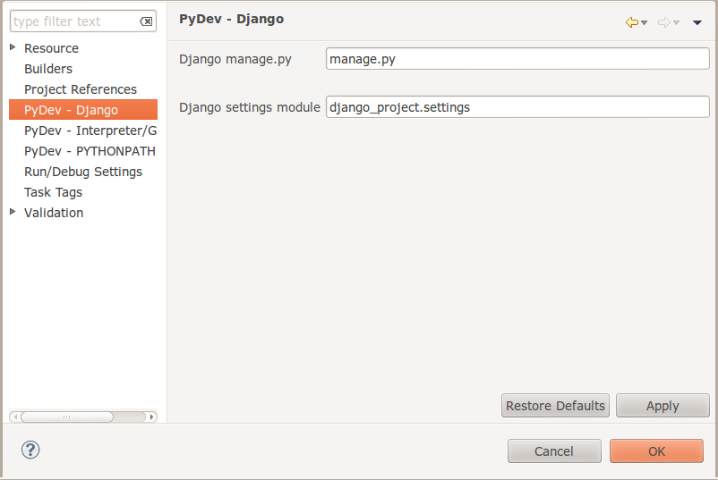

Developing using Eclipse (Linux)
================================

This section outlines how you can set up Eclipse with PyDev to work on an
existing Django aplication. The benifits? A complete IDE environment with a
debugger that will let you set breakpoints anywhere in your app and
interactively step through the code from that point.  You also get other nice
things like refactoring support, code completion and so on. 

.. note:: This is optional - you can use any environment you like for editing
   python, or even a simple text editor.

Install Eclipse
---------------

Under ubuntu you can simply do::
  
   sudo apt-get install eclipse

Install PyDev
-------------

.. note:: These steps are also explained in the PyDev documentation which is
   quite good.
   
First you need to do :menuselection:`Help->Install New Software`. Then click on the
:guilabel:`Add` button and fill in the details as shown below:

Add the PyDev extensions using the URL: http://pydev.org/updates

Next choose the PyDev and PyDev Extensions item from the 'work with' list and
wait a moment. Then tick :guilabel:`PyDev` from the software list and untick
:guilabel:`Contact all update sites to find required software`. Then click
:guilabel:`next` and wait while the packages download.

After you are done, click :guilabel:`finish` to close the installer and restart
Eclipse as prompted.

Setup your project
------------------

Choose the :guilabel:`PyDev source` and select :guilabel:`PyDev` from the list.
We are going to use our existing Django web site you want to work with, but
note that the PyDev will also happily create a new Django project from scratch
for you.

This is a 'broad strokes' outline of the process:

- Create a new django project in your Eclipse project but point it to our
  existing django project instead of using the Eclipse workspace.
- Setup Eclipse to be aware of our virtualenv
- Set breakpoints, run the development server and generally have fun with
  Django within an IDE

So, first up, open Eclipse and use a workspace - just use the default workspace
if you are not familiar with eclipse.

Next, create a new Django project: :menuselection:`File -> New -> Project`....
and then choose :guilabel:`PyDev Django Project` from the dialog that appears.

Click :guilabel:`next` and then you should give the project the same name as
the existing Django project that you want to bring into Eclipse (in our case
django-project). Also choose :guilabel:`don't configure PYTHONPATH` from the
options in the dialog that appears.

Use the hyperlink on the above dialog to configure your python interpreter. On
the screen that appears we get to tell PyDev where our virtual environment is.
Click :guilabel:`New` then fill the interpreter details in like this:

.. image:: img/image010.png  

When you click :guilabel:`OK`, a dialog like this will appear, and you should
enable the system python ('/usr/lib/python2.7' in my case) too.

Clicking :guilabel:`OK` will take you back to the Eclipse preferences window.

Now click OK and it will start doing some magic stuff, eventually bringing you
back to the 'PyDev Django Project' dialog. Be sure to change the interpreter
option to :guilabel:`Django-Training VirtualEnvironment` (or similar based on
your previous choices). Click :guilabel:`next` and you will be prompted for
your database connection details. You can completely ignore this since we will
be grafting in the settings from our existing 'django-project' project below. So
clicking :guilabel:`Finish` will end this part of the process.

You may need to press F5 to refresh the project view before you see all your
real project files. Good so now we have our project all set up in Eclipse.

There is one post setup thing you should do. Since we are using 1.4 which
introduced a change that separates the :file:`settings.py` and other resources
away from the project root directory, we need to tell Eclipse where to find
:file:`settings.py`. To do this :kbd:`Right-Click` the project folder and
select the PyDev Django option. Now update :guilabel:`Django settings module`
so that it points into the project subdirectory as shown in the screenshot
below.

Settings Tweaks
---------------

When running your django app under eclipse with SQLITE as the database, you
should ensure that your :file:`django_project/settings.py` file uses a soft
coded path to the database. To do that, add the following lines near the top::
   
  import os
  ROOT_DIR = os.path.dirname(os.path.abspath(os.path.join(__file__, '..')))
  DBPATH = os.path.join(ROOT_DIR, 'django.db')

Then modify your DATABASES clause so that it uses DBPATH to point you your
database::
  
   DATABASES = {
       'default': {
           'ENGINE': 'django.db.backends.sqlite3',
           'NAME': DBPATH,
           'USER': '',
           'PASSWORD': '',
           'HOST': '',
           'PORT': '',
       }
   }

Running Django
--------------

You can easily run django 

Debugging
---------

The last part of this article covers debugging. The process is really simple.
First open a source file (for example :file:`doodle_app/views.py`) and then
double click in a margin where you would like to place a break point.

Setting a breakpoint in your project (click for larger image)
  

Next you can run the django development server  by right clicking on the
project and from the context menu choosing :menuselection:`Debug As --> PyDev :
Django`.

  

PyDev will prompt you to switch to the debug perspective. Now you can go ahead
and open the site in your browser. When you hit the url that triggers the
breakpoint, PyDev will stop, highlight the line and you can use the normal
debugging tools for there on. You can view the state of any variable while
django is running and so on.

Running Unit tests from the IDE
...............................

PyDev has very good integrated support for unit testing. However we want to
specifically launch the Django test suite so we create a custom
:guilabel:`Run Configuration` as shown in the screenshots below:

.. image:: img/image013.png

.. image:: img/image014.png

.. note:: You can use a similar approach the above to make other django
   management commands (.e.g. syncdb) available from within Eclipse/PyDev.

Good, we will proceed from here knowing that you are able to do your
development in a rich IDE, and run your tests and debug your work easily. In
the next section we are going to start delving into views.

